# DAFTAR TUGAS

<table border="2" cellpading="10">
  <tr>
    <td><b>Pertemuan 4</b></td>
    <td>LatihanVCS</td>
    <td><a href="https://github.com/Aditya-Bani/LatihanVCS">Klik disini</td>
  </tr>
  <tr>
    <td><b>Pertemuan 5</b></td>
    <td>Biodata</td>
    <td><a href="">Klik disini</td>
  </tr>
  <tr>
    <td><b>Pertemuan 6</b></td>
    <td>Lab1 dan 2</td>
    <td><a href="https://github.com/Aditya-Bani/ProjectPraktikum">Klik disini</td>
  </tr>
  <tr>
    <td><b>Pertemuan 7</b></td>
    <td>Lab3</td>
    <td><a href="https://github.com/Aditya-Bani/Lab3">Klik disini</td>
  </tr>
  <td><b>Pertemuan 7</b></td>
  <td>Labspy02</td>
  <td><a href="https://github.com/Aditya-Bani/Labspy02">Klik disini</td>
  </tr>
  <td><b>Pertemuan 7</b></td>
  <td>Labspy03</td>
  <td><a href="https://github.com/Aditya-Bani/Labspy03">Klik disini</td>
</tr>

</table>

# Labspy03

# PENJELASAN LOOPING

- Repository ini menjelaskan tentang **LOOPING** pada program python
- **LOOPING** sendiri artinya perulangan,dalam bahasa pemrograman merupakan suatu pernyataan untuk
- menguntruksi komputer agar melakukan sesuatu secara berulang.
- Terdapat 2 jenis perulangan dalam bahasa pemrograman *python* ,yaitu perulangan **for** & **while** .
- Dan seperti inilah contoh dari program looping pada python.

# Alur Algoritma latihan1.py

**SOAL**

- Tampilkan n bilangan acak yang lebih kecil dari 0.5
-  Nilai n pada saat runtime
- Anda bisa menggunakan while atau for untuk menyelesaikannya
- Gunakan fungsi random () yang dapat di'import terlebih dahulu

- Kita mulai cara membuat program diatas 👆

**FLOWCHART LATIHAN1.PY**

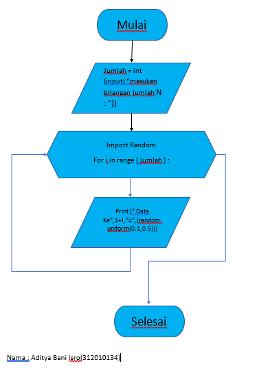

- Sebelum memulainya pastikan anda punya aplikasi **PYTHON**
- jika belum punya silahkan [link ini](https://filehippo.com/download_python/)
- Jika Sudah seperti biasa mendownload Apk lainnya hanya klik next - next - lalu finish :smiley:
- Buka aplikasi python tersebut
- Lalu pilih menu file - New File atau juga bisa tekan **CTRL + N**
- contoh nya seperti ini

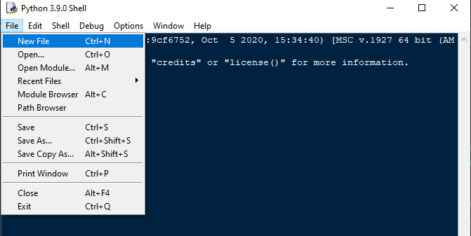

- Jika sudah lakukan kodingan seperti gambar di bawah ini

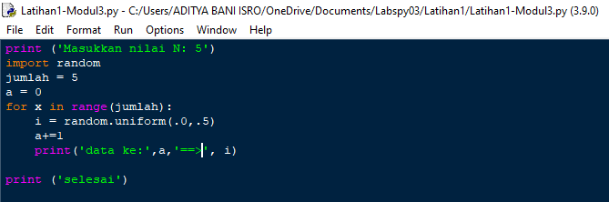

- Jika sudah kalian bisa save program kalian dengan tekan **CTRL+S** atau mengklik menu file - save as dan beri nama pada program kalian, seperti contoh dibawah ini :

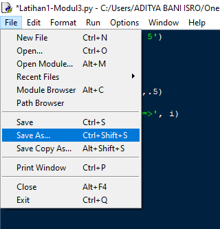

- lalu menjalankan program kalian dengan menekan **f5** atau mengklik menu **RUN**

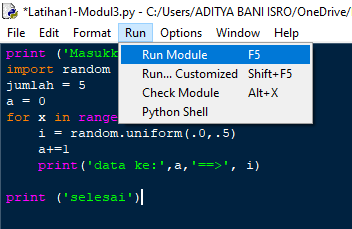

- Jika gagal silahkan cek kembali apakah kodingan kalian sudah seperti gambar diatas 👆
- Dan jika berhasil maka tampilan pada program python anda akan seperti ini 👇

- Berikut penjelasan dari program diatas

      1. print ('Masukkan nilai N: 5')
      2. import random
      3. jumlah = 5
      4. a = 0
      5. for x in range(jumlah):
      6.     i = random.uniform(.0,.5)
      7.     a+=1
      8.     print('data ke:',a,'==>', i)

      9. print ('selesai')

## PENJELASAN
- "print"  : berfungsi untuk mencetak atau menampilkan objek ke perangkat keluaran (layar) atau ke file teks.

- "import" : fungsi lanjut yang dipanggil oleh statement import.

- "random" : untuk menentukan suatu pilihan.

- "range"  : merupakan fungsi yang menghasilkan list. Fungsi ini akan menciptakan sebuah list baru dengan rentang nilai tertentu.

- "uniform": digunakan untuk menampilkan bilangan float random dengan batas awal bilangan x, dan batas akhir bilangan y.

# Alur Algoritma Latihan2.py

**SOAL**

- Buat program untuk menampilkan bilangan *terbesar* dari *n* buah data yang di'inputkan
- Dan masukkan angka nol untuk berhenti

- Kita mulai cara membuat program diatas 👆

**FLOWCHART**)

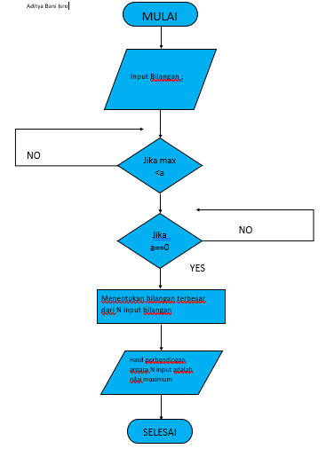

- Sebelum memulainya pastikan anda punya aplikasi **PYTHON**
- jika belum punya silahkan [link ini](https://filehippo.com/download_python/)
- Jika Sudah seperti biasa mendownload Apk lainnya hanya klik next - next - lalu finish :smiley:
- Buka aplikasi python tersebut
- Lalu pilih menu file - New File atau juga bisa tekan **CTRL + N**
- contoh nya seperti ini

- Jika sudah lakukan kodingan seperti gambar di bawah ini

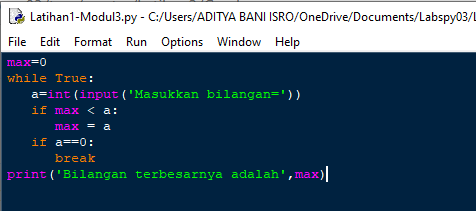

- Jika sudah kalian bisa save program kalian dengan tekan **CTRL+S** atau mengklik menu file - save as dan beri nama pada program kalian

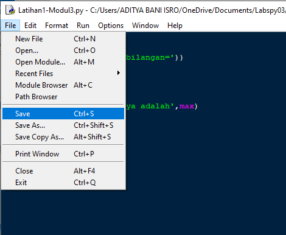

- lalu menjalankan program kalian dengan menekan **f5** atau mengklik menu **RUN**

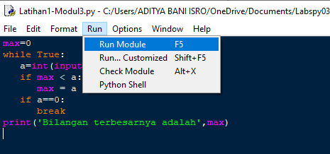

- Jika gagal silahkan cek kembali apakah kodingan kalian sudah seperti gambar diatas 👆
- Dan jika berhasil maka tampilan pada program python anda akan seperti ini 👇

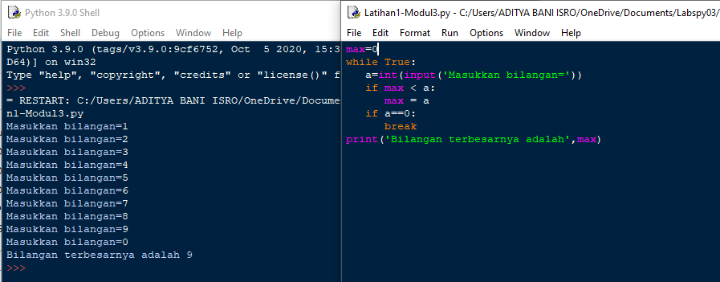

- Berikut penjelas Latihan2.py

      1. max=0
      2. while True:
      3.   a=int(input('Masukkan bilangan='))
      4.   if max < a:
      5.      max = a
      6.   if a==0:
      7.      break
      8. print('Bilangan terbesarnya adalah',max)

- "max"	: fungsi bulid-in untuk mencari nilai tertinggi. Fungsi ini dapat diberikan sebuah parameter berupa angka.

- "while"	: disebut uncounted loop (perulangan yang tak terhitung), untuk perulangan yang memiliki syarat dan tidak tentu berapa banyak
perulangannya.

- "int"	: berfungsi mengkonversi bilangan maupun string angka menjadi bilangan bulat (integer).

- "if"	= Bila suatu kondisi tertentu tercapai maka apa yang harus dilakukan. Dengan fungsi ini kita bisa menjalankan suatu perintah dalam kondisi tertentu.

- "input"	: masukan yang kita berikan ke program.

- "break"	: fungsi yang menghentikan operasi dibawahnya jika suatu kondisi yang ditentukan telah tercapai.

- "print"	: berfungsi untuk mencetak atau menampilkan objek ke perangkat keluaran (layar) atau ke file teks.

# Alur Algoritma program1.py

- Buat program sederhana dengan perulangan,
- Seorang pengusaha menginvestasikan uangnya untuk memulai usahanya
- Dengan modal awal 100 juta
- Pada bulan pertama dan kedua belum mendapatkan laba
- Pada bulan ketiga baru mulai mendapatkan laba sebesar 1%
- Pada bulan kelima pendapatan meningkat 5%
- Selanjutnya pada bulan ke-8 mengalami penurunan keuntungan sebesar 2%
- Sehingga laba menjadi 3%
- Hitung total keuntungan selama 8 bulan berjalan usahanya

- Kita mulai cara membuat program diatas 👆

**FLOWCHART**

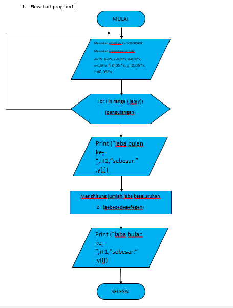

- Sebelum memulainya pastikan anda punya aplikasi **PYTHON**
- jika belum punya silahkan [link ini](https://filehippo.com/download_python/)
- Jika Sudah seperti biasa mendownload Apk lainnya hanya klik next - next - lalu finish :smiley:
- Buka aplikasi python tersebut
- Lalu pilih menu file - New File atau juga bisa tekan **CTRL + N**
- contoh nya seperti ini

- Jika sudah lakukan kodingan seperti gambar di bawah ini

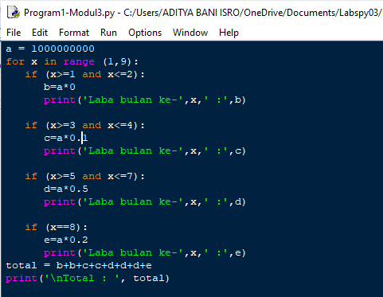

- Jika sudah kalian bisa save program kalian dengan tekan **CTRL+S** atau mengklik menu file - save as dan beri nama pada program kalian

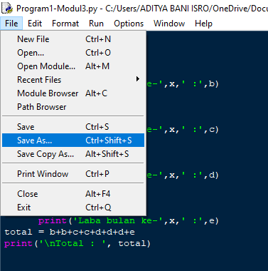

- lalu menjalankan program kalian dengan menekan **f5** atau mengklik menu **RUN**

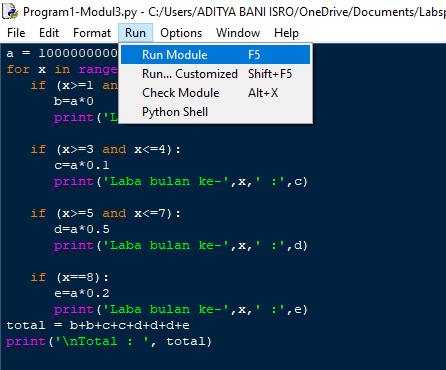

- Jika gagal silahkan cek kembali apakah kodingan kalian sudah seperti gambar diatas 👆
- Dan jika berhasil maka tampilan pada program python anda akan seperti ini 👇

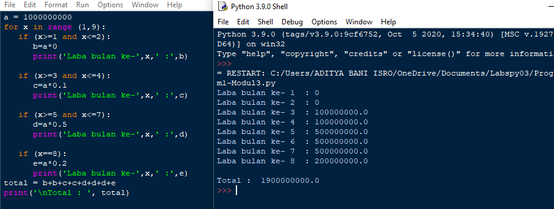

## Berikut penjelasan dari Program1.py

    - masukkan nilai a

    - gunakan for untuk perulangan dari 1 sampai 8.Perulangan for disebut counted loop (perulangan yang terhitung)

    - lalu gunakan if pertama untuk menentukan laba bulan ke 1 dan ke 2.masukan variabel (b) kalikan nilai (a) dengan data bulan 1 dan 2. cetak (x) dan (b)

    - lalu gunakan if kedua untuk menentukan laba bulan ke 3 dan ke 4.masukan variabel (b) kalikan nilai (a) dengan data bulan 3 dan 4. cetak (x) dan (c)

    - lalu gunakan if ketiga untuk menentukan laba bulan ke 5 sampai ke 7.masukan variabel (b) kalikan nilai (a) dengan data bulan 5 sampai 7. cetak (x) dan (d)

    - lalu gunakan if keempat untuk menentukan laba bulan ke 8.masukan variabel (b) kalikan nilai (a) dengan data bulan 8. cetak (x) dan (e)

    - lalu total keseluruhan.

    - cetak total

                  Nama : Aditya Bani Isro

                     NIM : 312010134

                     Kelas : TI.20 A.1
